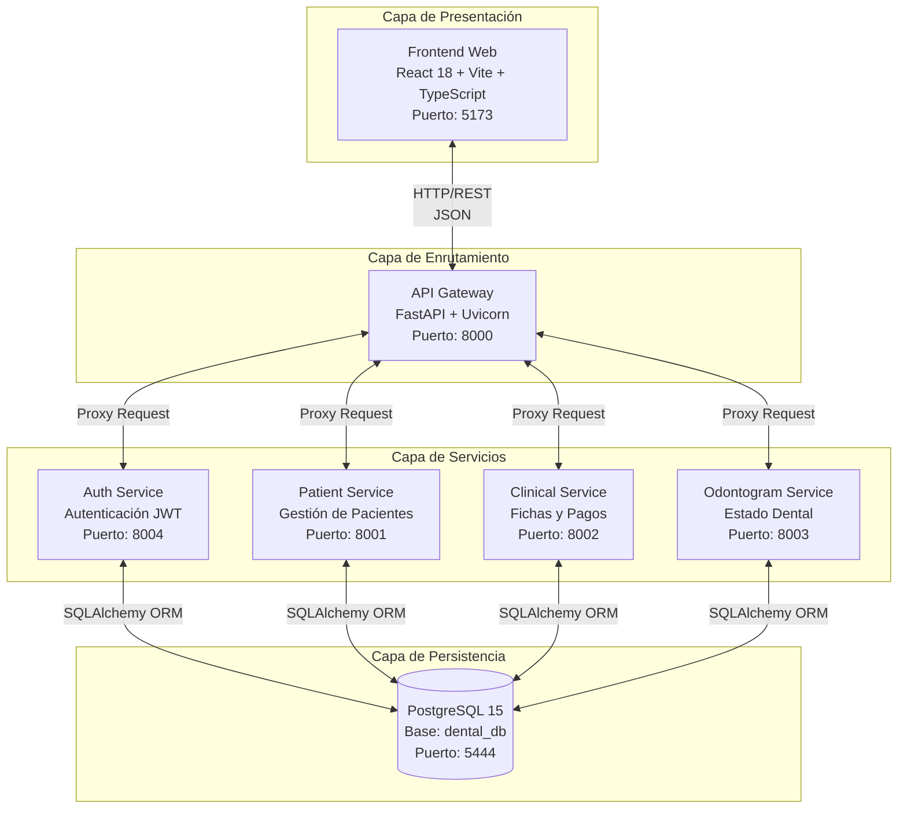
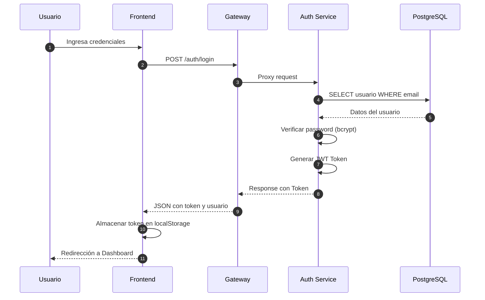
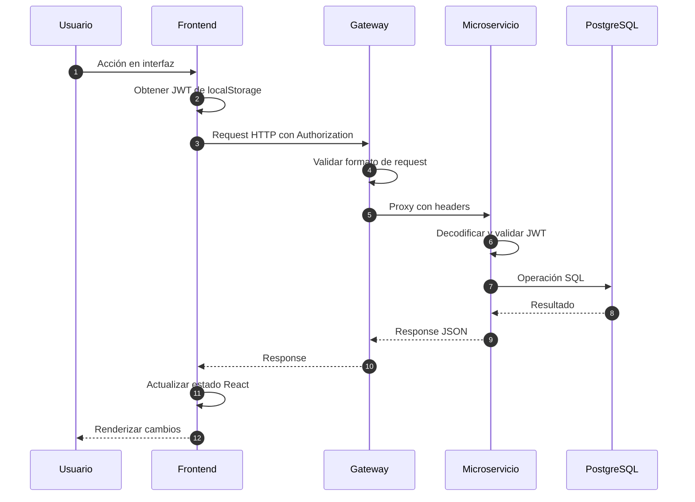
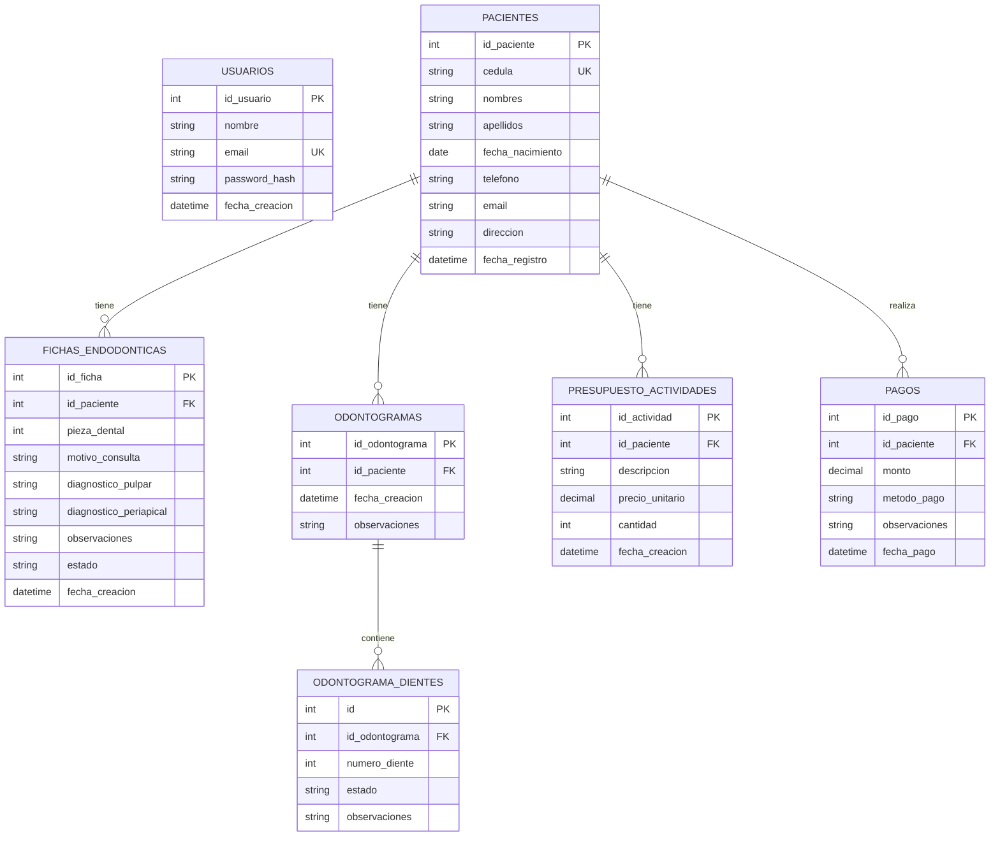

<p align="center">
  
  
  
  
  
  
</p>

<h1 align="center">EndoNova</h1>
<h3 align="center">Sistema de Gestión Odontológica Especializado en Endodoncia</h3>

<p align="center">
  Aplicación web con arquitectura de microservicios para la gestión integral de fichas de diagnóstico y tratamiento endodóntico en clínicas odontológicas.
</p>

---

## Tabla de Contenidos

1. [Descripción General](#descripción-general)
2. [Arquitectura del Sistema](#arquitectura-del-sistema)
3. [Tecnologías Utilizadas](#tecnologías-utilizadas)
4. [Estructura del Proyecto](#estructura-del-proyecto)
5. [Modelo de Datos](#modelo-de-datos)
6. [Requisitos Previos](#requisitos-previos)
7. [Instalación y Configuración](#instalación-y-configuración)
8. [Ejecución del Sistema](#ejecución-del-sistema)
9. [Documentación de la API](#documentación-de-la-api)
10. [Gestión de Base de Datos](#gestión-de-base-de-datos)
11. [Solución de Problemas](#solución-de-problemas)

---

## Descripción General

**EndoNova** es un sistema integral de gestión odontológica diseñado específicamente para clínicas especializadas en endodoncia. El sistema permite administrar de forma eficiente los siguientes módulos:

| Módulo | Descripción |
|--------|-------------|
| **Gestión de Pacientes** | Registro completo con datos personales, información de contacto y fecha de nacimiento |
| **Fichas Endodónticas** | Diagnósticos pulpares y periapicales organizados por pieza dental |
| **Odontograma Interactivo** | Visualización y registro gráfico del estado dental del paciente |
| **Presupuestos y Pagos** | Control financiero de tratamientos, actividades y registro de cobros |

El sistema implementa una **arquitectura de microservicios** que garantiza escalabilidad, mantenibilidad, alta cohesión y bajo acoplamiento entre componentes.

---

## Arquitectura del Sistema

### Diagrama de Arquitectura General



### Diagrama de Secuencia: Flujo de Autenticación



### Diagrama de Secuencia: Operación CRUD Típica



### Descripción de Microservicios

| Servicio | Puerto | Responsabilidad | Endpoints Principales |
|----------|--------|-----------------|----------------------|
| **Gateway** | 8000 | Punto único de entrada, enrutamiento | Proxy a todos los servicios |
| **Auth Service** | 8004 | Registro, autenticación, JWT | `/auth/register`, `/auth/login` |
| **Patient Service** | 8001 | CRUD pacientes, validación cédula | `/patients/`, `/patients/{id}` |
| **Clinical Service** | 8002 | Fichas, presupuestos, pagos, stats | `/fichas/`, `/presupuesto/`, `/pagos/`, `/stats` |
| **Odontogram Service** | 8003 | Odontogramas, estados, historial | `/odontograma/`, `/historial/` |

---

## Tecnologías Utilizadas

### Backend

| Tecnología | Versión | Propósito |
|------------|---------|-----------|
| Python | 3.11+ | Lenguaje de programación |
| FastAPI | 0.104+ | Framework web asíncrono |
| Uvicorn | 0.24+ | Servidor ASGI |
| SQLAlchemy | 2.0+ | ORM para base de datos |
| Pydantic | 2.0+ | Validación de datos y schemas |
| PyJWT | 2.8+ | Manejo de tokens JWT |
| Bcrypt | 4.0+ | Hashing de contraseñas |
| Psycopg2 | 2.9+ | Driver PostgreSQL |

### Frontend

| Tecnología | Versión | Propósito |
|------------|---------|-----------|
| React | 18.2+ | Biblioteca de UI |
| TypeScript | 5.0+ | Tipado estático |
| Vite | 5.0+ | Build tool y dev server |
| Tailwind CSS | 3.4+ | Framework de estilos |
| Axios | 1.6+ | Cliente HTTP |
| React Router DOM | 6.0+ | Enrutamiento SPA |

### Infraestructura

| Tecnología | Versión | Propósito |
|------------|---------|-----------|
| Docker | 24.0+ | Contenedorización |
| Docker Compose | 2.0+ | Orquestación de contenedores |
| PostgreSQL | 15 | Base de datos relacional |

---

## Estructura del Proyecto

```
EndoNova/
│
├── auth-service/                   # Microservicio de autenticación
│   ├── app/
│   │   ├── main.py                 # Endpoints de auth
│   │   ├── models.py               # Modelo Usuario
│   │   ├── schemas.py              # Schemas Pydantic
│   │   ├── database.py             # Configuración SQLAlchemy
│   │   └── auth_utils.py           # Utilidades JWT y bcrypt
│   ├── Dockerfile
│   └── requirements.txt
│
├── patient-service/                # Microservicio de pacientes
│   ├── app/
│   │   ├── main.py                 # Endpoints CRUD pacientes
│   │   ├── models.py               # Modelo Paciente
│   │   ├── schemas.py              # Schemas Pydantic
│   │   └── database.py             # Configuración SQLAlchemy
│   ├── Dockerfile
│   └── requirements.txt
│
├── clinical-service/               # Microservicio clínico
│   ├── app/
│   │   ├── main.py                 # Endpoints fichas, pagos, stats
│   │   ├── models.py               # Modelos Ficha, Presupuesto, Pago
│   │   ├── schemas.py              # Schemas Pydantic
│   │   └── database.py             # Configuración SQLAlchemy
│   ├── Dockerfile
│   └── requirements.txt
│
├── odontogram-service/             # Microservicio de odontograma
│   ├── app/
│   │   ├── main.py                 # Endpoints odontograma
│   │   ├── models.py               # Modelos Odontograma, Diente
│   │   ├── schemas.py              # Schemas Pydantic
│   │   └── database.py             # Configuración SQLAlchemy
│   ├── Dockerfile
│   └── requirements.txt
│
├── gateway/                        # API Gateway
│   ├── main.py                     # Configuración de proxy
│   ├── Dockerfile
│   └── requirements.txt
│
├── frontend/                       # Aplicación React
│   ├── public/
│   ├── src/
│   │   ├── api/
│   │   │   └── axios.ts            # Configuración Axios
│   │   ├── components/
│   │   │   ├── Layout.jsx          # Layout principal
│   │   │   ├── FichaEndonova.tsx   # Componente fichas
│   │   │   ├── Odontogram.tsx      # Componente odontograma
│   │   │   ├── PresupuestoPagos.tsx# Componente financiero
│   │   │   └── Toast.tsx           # Notificaciones
│   │   ├── pages/
│   │   │   ├── Login.tsx           # Página de login
│   │   │   ├── Dashboard.tsx       # Panel principal
│   │   │   ├── Pacientes.tsx       # Gestión pacientes
│   │   │   ├── FichaPage.tsx       # Página de fichas
│   │   │   ├── OdontogramaPage.tsx # Página odontograma
│   │   │   └── PagosPage.tsx       # Página de pagos
│   │   ├── types/                  # Definiciones TypeScript
│   │   ├── App.tsx                 # Componente raíz
│   │   ├── main.tsx                # Entry point
│   │   └── index.css               # Estilos globales
│   ├── package.json
│   ├── vite.config.ts
│   ├── tailwind.config.js
│   └── tsconfig.json
│
├── docker-compose.yml              # Orquestación de servicios
├── README.md                       # Documentación técnica
└── .gitignore
```

---

## Modelo de Datos

### Diagrama Entidad-Relación



### Descripción de Tablas

| Tabla | Descripción | Campos Clave |
|-------|-------------|--------------|
| `usuarios` | Usuarios del sistema (odontólogos, administrativos) | email único, password hasheado |
| `pacientes` | Información de pacientes | cédula única, datos de contacto |
| `fichas_endodonticas` | Diagnósticos por pieza dental | diagnóstico pulpar/periapical |
| `odontogramas` | Registro histórico de estados dentales | fecha de creación |
| `odontograma_dientes` | Estado individual de cada diente | 32 permanentes + 20 deciduos |
| `presupuesto_actividades` | Items del presupuesto | precio, cantidad |
| `pagos` | Registro de cobros realizados | monto, método de pago |

---

## Requisitos Previos

### Software Requerido

| Software | Versión Mínima | Descarga |
|----------|----------------|----------|
| Docker Desktop | 4.0+ | https://www.docker.com/products/docker-desktop |
| Node.js | 18.0+ | https://nodejs.org/ |
| Git | 2.0+ | https://git-scm.com/ |

### Verificación de Instalación

```bash
# Verificar Docker
docker --version
docker compose version

# Verificar Node.js
node --version
npm --version

# Verificar Git
git --version
```

---

## Instalación y Configuración

### Paso 1: Clonar el Repositorio

```bash
git clone <url-del-repositorio>
cd EndoNova
```

### Paso 2: Variables de Entorno

Las variables están preconfiguradas en `docker-compose.yml`:

| Variable | Valor | Descripción |
|----------|-------|-------------|
| `POSTGRES_USER` | user_admin | Usuario de PostgreSQL |
| `POSTGRES_PASSWORD` | admin_password | Contraseña de PostgreSQL |
| `POSTGRES_DB` | dental_db | Nombre de la base de datos |
| `DATABASE_URL` | postgresql://user_admin:admin_password@db:5432/dental_db | Cadena de conexión |

### Paso 3: Construir e Iniciar Servicios

```bash
# Construir imágenes y levantar contenedores
docker compose up -d --build

# Verificar estado de los servicios
docker compose ps
```

Salida esperada:

```
NAME                           STATUS              PORTS
endonova-db-1                  running (healthy)   0.0.0.0:5444->5432/tcp
endonova-auth-service-1        running             0.0.0.0:8004->8000/tcp
endonova-patient-service-1     running             0.0.0.0:8001->8000/tcp
endonova-clinical-service-1    running             0.0.0.0:8002->8000/tcp
endonova-odontogram-service-1  running             0.0.0.0:8003->8000/tcp
endonova-gateway-1             running             0.0.0.0:8000->8000/tcp
```

### Paso 4: Instalar y Ejecutar Frontend

```bash
cd frontend
npm install
npm run dev
```

---

## Ejecución del Sistema

### URLs de Acceso

| Componente | URL | Descripción |
|------------|-----|-------------|
| Frontend | http://localhost:5173 | Interfaz de usuario |
| Gateway | http://localhost:8000 | API Gateway |
| Auth Service | http://localhost:8004 | Servicio de autenticación |
| Patient Service | http://localhost:8001 | Servicio de pacientes |
| Clinical Service | http://localhost:8002 | Servicio clínico |
| Odontogram Service | http://localhost:8003 | Servicio de odontograma |

### Mapeo de Puertos

```
Host (Local)          Contenedor
    5173       <-->      5173       Frontend
    8000       <-->      8000       Gateway
    8001       <-->      8000       Patient Service
    8002       <-->      8000       Clinical Service
    8003       <-->      8000       Odontogram Service
    8004       <-->      8000       Auth Service
    5444       <-->      5432       PostgreSQL
```

---

## Documentación de la API

### Swagger UI (OpenAPI)

Cada microservicio expone documentación interactiva automática generada por FastAPI:

| Servicio | Swagger UI | ReDoc |
|----------|------------|-------|
| Gateway | http://localhost:8000/docs | http://localhost:8000/redoc |
| Auth | http://localhost:8004/docs | http://localhost:8004/redoc |
| Patient | http://localhost:8001/docs | http://localhost:8001/redoc |
| Clinical | http://localhost:8002/docs | http://localhost:8002/redoc |
| Odontogram | http://localhost:8003/docs | http://localhost:8003/redoc |

### Endpoints Principales

#### Auth Service

| Método | Endpoint | Descripción | Request Body |
|--------|----------|-------------|--------------|
| POST | `/auth/register` | Registrar usuario | `{nombre, email, password}` |
| POST | `/auth/login` | Iniciar sesión | `{email, password}` |

#### Patient Service

| Método | Endpoint | Descripción | Request Body |
|--------|----------|-------------|--------------|
| GET | `/patients/` | Listar pacientes | - |
| GET | `/patients/{id}` | Obtener por ID | - |
| POST | `/patients/` | Crear paciente | `{cedula, nombres, apellidos, ...}` |
| PUT | `/patients/{id}` | Actualizar | `{campos a actualizar}` |
| DELETE | `/patients/{id}` | Eliminar | - |

#### Clinical Service

| Método | Endpoint | Descripción |
|--------|----------|-------------|
| GET | `/fichas/{paciente_id}` | Listar fichas del paciente |
| POST | `/fichas/` | Crear ficha endodóntica |
| PUT | `/fichas/{id}` | Actualizar ficha |
| DELETE | `/fichas/{id}` | Eliminar ficha |
| GET | `/presupuesto/{paciente_id}` | Obtener presupuesto |
| POST | `/presupuesto/` | Agregar actividad |
| DELETE | `/presupuesto/{id}` | Eliminar actividad |
| GET | `/pagos/{paciente_id}` | Listar pagos |
| POST | `/pagos/` | Registrar pago |
| GET | `/stats` | Estadísticas generales |

#### Odontogram Service

| Método | Endpoint | Descripción |
|--------|----------|-------------|
| GET | `/odontograma/{paciente_id}` | Obtener odontograma actual |
| POST | `/odontograma/` | Crear/actualizar odontograma |
| GET | `/historial/{paciente_id}` | Historial de odontogramas |

---

## Gestión de Base de Datos

### Conexión con Cliente Externo

Parámetros para DBeaver, pgAdmin u otro cliente:

| Parámetro | Valor |
|-----------|-------|
| Host | localhost |
| Puerto | 5444 |
| Base de datos | dental_db |
| Usuario | user_admin |
| Contraseña | admin_password |

### Conexión mediante CLI

```bash
# Acceder a psql dentro del contenedor
docker compose exec db psql -U user_admin -d dental_db

# Comandos útiles
\dt                    # Listar tablas
\d+ nombre_tabla       # Describir tabla
\q                     # Salir
```

### Consultas de Ejemplo

```sql
-- Listar usuarios registrados
SELECT id_usuario, nombre, email, fecha_creacion 
FROM usuarios 
ORDER BY fecha_creacion DESC;

-- Listar pacientes
SELECT id_paciente, cedula, nombres, apellidos, telefono 
FROM pacientes 
ORDER BY fecha_registro DESC;

-- Fichas endodónticas abiertas
SELECT f.id_ficha, f.pieza_dental, f.diagnostico_pulpar, 
       p.nombres, p.apellidos 
FROM fichas_endodonticas f
JOIN pacientes p ON f.id_paciente = p.id_paciente
WHERE f.estado = 'ABIERTA';

-- Resumen financiero por paciente
SELECT 
    p.id_paciente,
    p.nombres || ' ' || p.apellidos AS paciente,
    COALESCE(SUM(a.precio_unitario * a.cantidad), 0) AS total_presupuesto,
    COALESCE(
        (SELECT SUM(monto) FROM pagos WHERE id_paciente = p.id_paciente), 
        0
    ) AS total_pagado
FROM pacientes p
LEFT JOIN presupuesto_actividades a ON p.id_paciente = a.id_paciente
GROUP BY p.id_paciente, p.nombres, p.apellidos;
```

---

## Solución de Problemas

### Puerto Ocupado

**Síntoma:** Error `port is already allocated`

**Solución:**

```bash
# Identificar proceso usando el puerto (ejemplo: 5444)

# Windows
netstat -ano | findstr :5444

# Linux/Mac
lsof -i :5444

# Opción: Modificar puerto en docker-compose.yml
```

### Base de Datos No Saludable

**Síntoma:** Servicio `db` no muestra estado `(healthy)`

**Solución:**

```bash
# Ver logs del contenedor
docker compose logs db

# Reiniciar solo la base de datos
docker compose restart db
```

### Reset Completo del Sistema

> **Advertencia:** Este comando elimina todos los datos permanentemente.

```bash
# Detener y eliminar volúmenes
docker compose down -v

# Reconstruir desde cero
docker compose up -d --build
```

### Logs de Servicios

```bash
# Ver logs de todos los servicios
docker compose logs

# Ver logs de un servicio específico
docker compose logs auth-service

# Seguir logs en tiempo real
docker compose logs -f gateway
```

### Errores Comunes

| Error | Causa Probable | Solución |
|-------|----------------|----------|
| `CORS error` | Gateway no responde | Verificar que Gateway esté corriendo |
| `Network Error` | Servicios no iniciados | Ejecutar `docker compose up -d` |
| `401 Unauthorized` | Token expirado/inválido | Cerrar sesión y volver a iniciar |
| `409 Conflict` | Cédula duplicada | La cédula ya existe en el sistema |

---

## Comandos de Referencia Rápida

```bash
# Iniciar sistema completo
docker compose up -d --build && cd frontend && npm run dev

# Detener sistema
docker compose down

# Ver estado de contenedores
docker compose ps

# Ver logs en tiempo real
docker compose logs -f

# Reset completo (elimina datos)
docker compose down -v && docker compose up -d --build

# Acceder a PostgreSQL
docker compose exec db psql -U user_admin -d dental_db
```

---

## Información del Proyecto

| Campo | Valor |
|-------|-------|
| Materia | Aplicaciones Web |
| Proyecto | Sistema de Gestión Odontológica |
| Arquitectura | Microservicios |
| Fecha de Entrega | 26 de enero de 2026 |

---

<p align="center">
  <strong>EndoNova</strong> - Sistema de Gestión Odontológica
</p>
